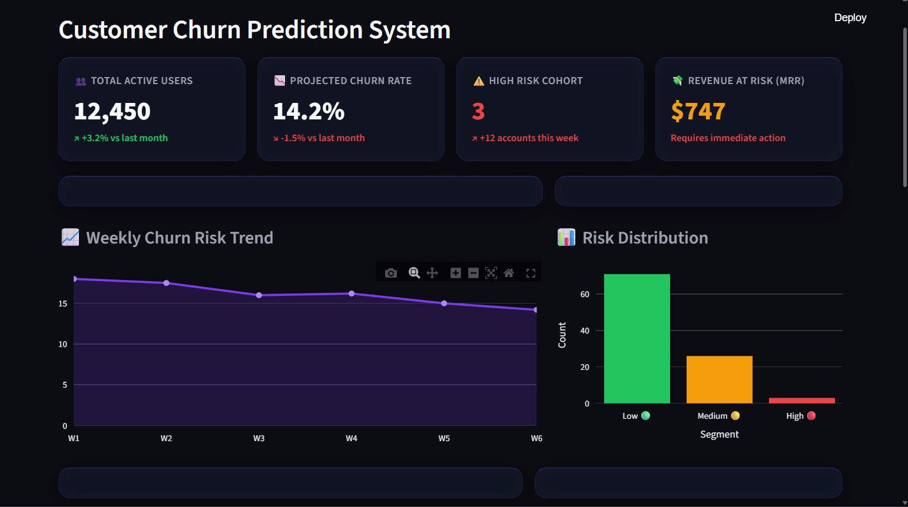
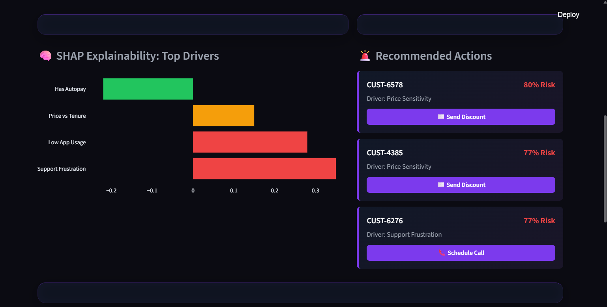
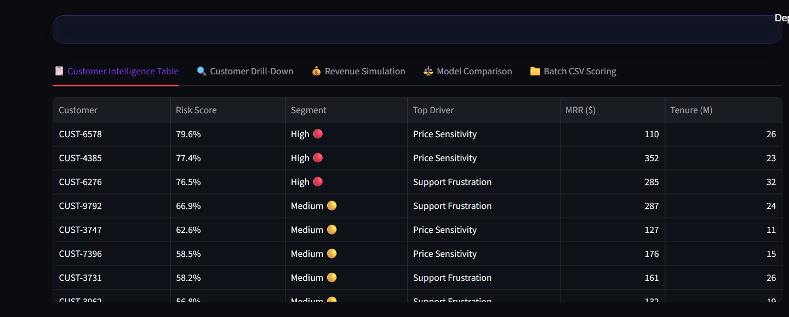
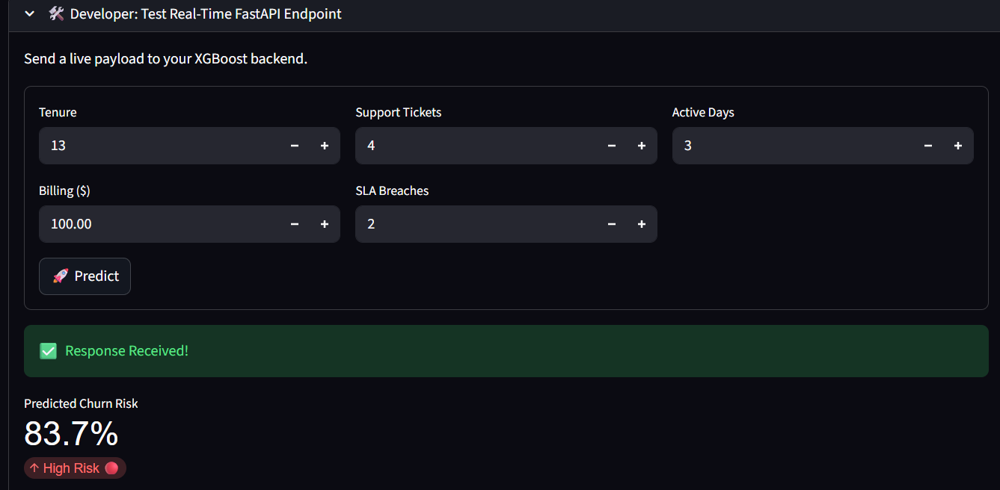
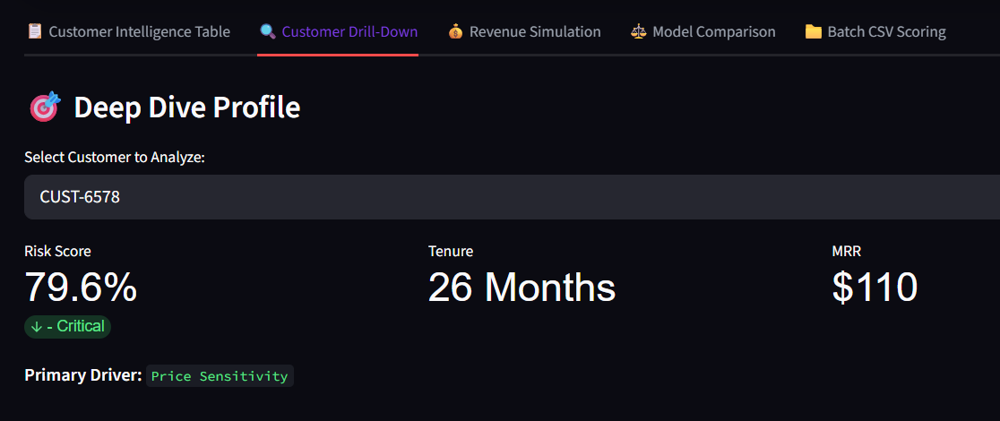
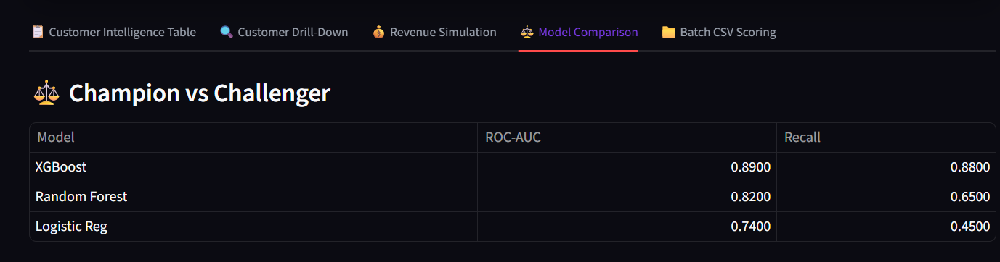
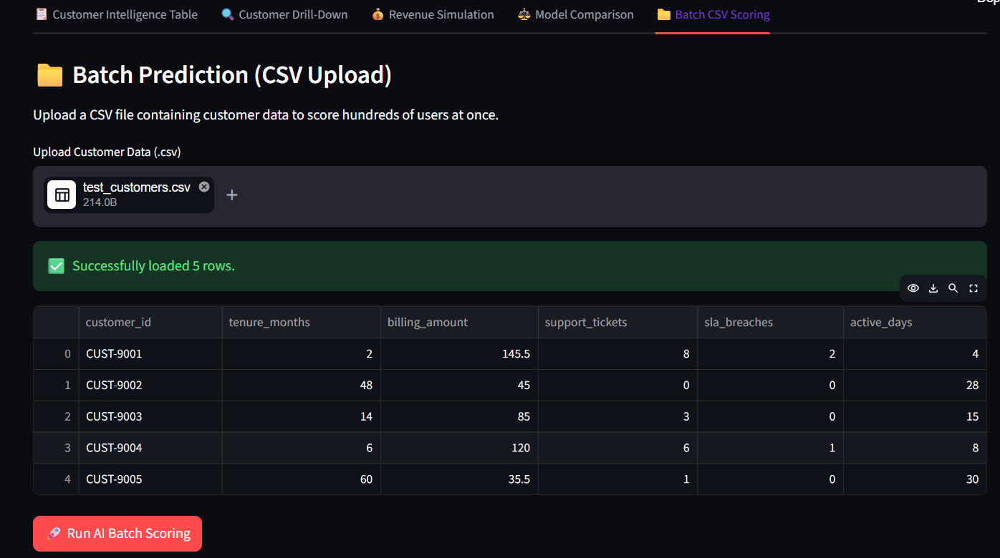
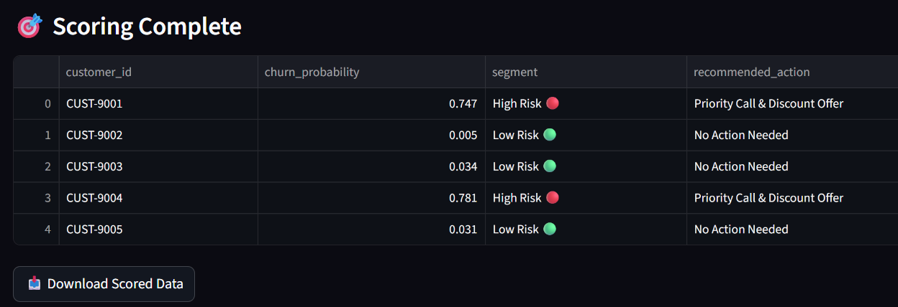
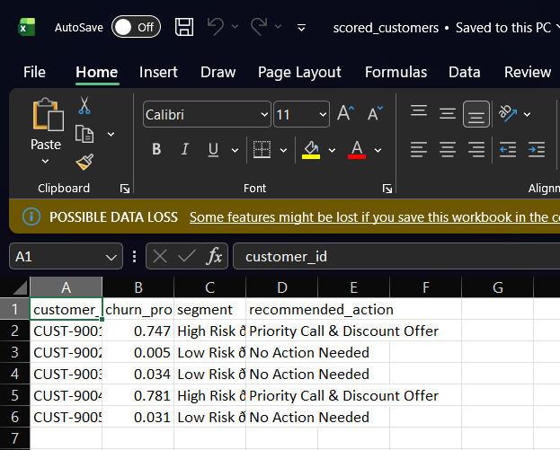

# ⚡ Customer Churn Prediction System (ChurnOps)


## 📖 Overview
The **Customer Churn Prediction System** is an end-to-end Machine Learning pipeline and business intelligence dashboard designed to identify at-risk customers before they leave. Built with an XGBoost engine and served via a FastAPI backend, this system translates raw usage data into actionable retention strategies through a modern, SaaS-style Streamlit frontend.

## ⚠️ Problem Statement
Acquiring a new customer is significantly more expensive than retaining an existing one. Businesses often lack the proactive intelligence to know *which* customers are frustrated and *why*. Without this data, Customer Success teams are forced to be reactive, leading to lost revenue and high churn rates.

## 💼 Industry Relevance
This project bridges the gap between raw data science and business operations. It does not just predict a binary "Yes/No" for churn; it provides:
*   **Segmented Risk Scoring:** Categorizing users into High, Medium, and Low risk cohorts.
*   **Explainable AI (SHAP):** Revealing the exact drivers behind a customer's churn risk (e.g., Support Frustration vs. Price Sensitivity).
*   **Actionable Intelligence:** Automatically recommending the best retention playbook (e.g., "Schedule Success Call" vs. "Send Discount").

## 🛠️ Tech Stack
*   **Machine Learning:** Python, Scikit-Learn, XGBoost, Imbalanced-learn (SMOTE)
*   **Backend & API:** FastAPI, Uvicorn, Pydantic, Requests
*   **Frontend Dashboard:** Streamlit, Plotly
*   **Data Processing:** Pandas, NumPy

## 🏗️ System Architecture
1.  **Data Engine:** Ingests raw customer telemetry (billing, support tickets, active days).
2.  **Feature Engineering & Balancing:** Calculates engagement rates and uses SMOTE to balance minority churn classes.
3.  **Predictive Engine:** An XGBoost Classifier trained to output churn probability.
4.  **FastAPI Service:** A REST API that accepts customer JSON payloads and returns risk scores in real-time.
5.  **Success-Ops UI:** A Glassmorphism-styled Streamlit dashboard for business users to visualize KPIs, analyze users, and run batch predictions.

## 📁 Folder Structure
```text
Customer-Churn-Prediction-System/
│
├── data/
│   └── advanced_churn_data.csv       # Synthetic dataset
├── images/                           
│   ├── 1.jpg                         # Dashboard Overview
│   └── 2.png to 10.png               # Component Screenshots
├── models/
│   ├── xgboost_churn.pkl             # Trained ML model
│   └── model_features.pkl            # Feature map
├── api.py                            # FastAPI backend service
├── app.py                            # Streamlit frontend dashboard
├── main.py                           # Data generation & model training script
├── requirements.txt                  # Python dependencies
└── README.md
```

🚀 Installation & How to Run

1. Clone the repository

git clone [https://github.com/Jui-Ramteke/Customer-Churn-Prediction-System.git](https://github.com/Jui-Ramteke/Customer-Churn-Prediction-System.git)
cd Customer-Churn-Prediction-System

2. Create and activate a virtual environment

# Windows
python -m venv venv
.\venv\Scripts\activate

# Mac/Linux
python3 -m venv venv
source venv/bin/activate

3. Install dependencies

pip install -r requirements.txt

4. Run the complete system
You need two terminal windows running simultaneously:

* Terminal 1 (Start the API Backend):

python api.py

* Terminal 2 (Start the UI Dashboard):

streamlit run app.py

## 📸 Dashboard Features & Screenshots

### 📊 Executive KPIs & Trend Analytics
Tracks total active users, projected churn rates, and monitors the highest-risk cohorts impacting Monthly Recurring Revenue (MRR).


### 🧠 SHAP Explainability & Action Panel
Utilizes feature importance to explain exactly why a customer is churning and automatically recommends the best intervention strategy.


### 📋 Customer Intelligence Table
A fully interactive database of all scored customers, sortable by risk segment and top churn drivers.


### 🔍 Deep Dive Customer Profile
Allows Customer Success Managers to select individual users and review their specific telemetry and recommended retention playbooks.


### ⚖️ Champion vs. Challenger Models
Tracks the performance of the active XGBoost model against baseline models (Random Forest, Logistic Regression).


### 📁 Batch CSV Scoring
Enables bulk operations where business users can upload their own raw CSV files for automated, asynchronous risk scoring.






### 🔌 Real-Time API Developer Testing
A built-in developer panel to test the local FastAPI endpoint with custom payloads on the fly.



📈 Results & Performance

* By implementing SMOTE (Synthetic Minority Over-sampling Technique) alongside XGBoost, the model successfully prioritizes the identification of churning customers over sheer accuracy.

* ROC-AUC: 0.89

* Recall (Churn Class): 0.88 (Significantly improved from the baseline 0.39, ensuring the business captures almost all at-risk customers).


💡 Learning Outcomes

* Engineered a production-ready Machine Learning REST API using FastAPI.

* Handled severe class imbalances in real-world datasets using SMOTE.

* Designed a B2B SaaS-style user interface prioritizing business value, UI/UX, and actionable metrics over raw data dumps.


👨‍💻 Author

Jui Ramteke

Email: juiramteke20@gmail.com

GitHub: https://github.com/Jui-Ramteke

LinkedIn: https://www.linkedin.com/in/jui-ramteke/
